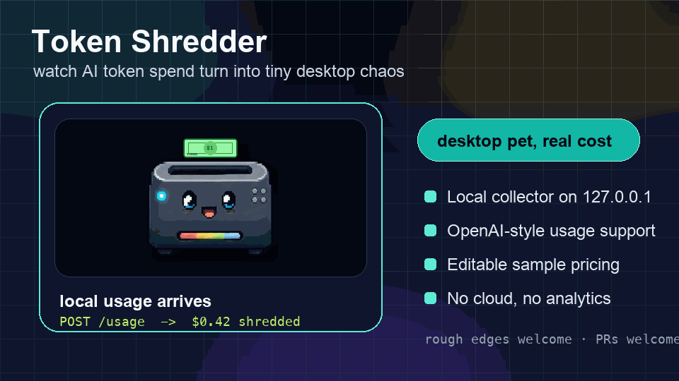
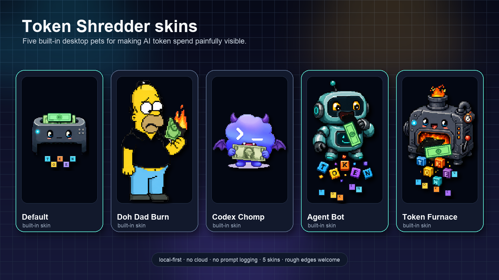

# Token Shredder

一个本机运行的 AI token 成本桌面宠物。把 Agent、脚本、SDK 或本地代理产生的 usage 发到本机，它会把 AI token 花费实时碎成 TOKEN 字块。

A tiny desktop pet that shreds your AI token spending in real time.

> 别再假装 tokens 不花钱。看着你的 AI Agent 实时碎钞。
>
> Stop pretending tokens are free. Watch your AI agent shred dollars in real time.

<p>
  <a href="https://github.com/qnianjinri-del/token-shredder/stargazers">
    
  </a>
  <a href="https://github.com/qnianjinri-del/token-shredder/releases/latest">
    
  </a>
  <a href="https://qnianjinri-del.github.io/token-shredder/">
    
  </a>
</p>



Token Shredder 是一个 local-first 的 Electron 桌面宠物。你可以先用内置一键试玩，不需要 API Key；也可以配置 provider key、Base URL、模型 ID 和可编辑示例价格，把 OpenAI-compatible 客户端指向本机代理。像素宠物会把真实 token 消耗变成碎掉的 TOKEN 字块。

第一次使用最短路径：打开 App，右键宠物进入后台，停在 `开始` 分区，先点 `运行自动体检`，再选择 `一键试玩`、`复制给 Codex/ChatGPT` 或 `POST /usage`。

Token Shredder is a local-first Electron desktop pet. Click the built-in quick demo to try it without an API key, or configure your provider key, base URL, model ID, and editable sample token prices to point an OpenAI-compatible client at the local proxy.

## 中文快速开始

完整中文说明见：[docs/README.zh-CN.md](docs/README.zh-CN.md)

最快体验：

1. 从 [GitHub Releases](https://github.com/qnianjinri-del/token-shredder/releases/latest) 下载 macOS 版本。
2. 打开 Token Shredder，桌面会出现一个像素风计费宠物。
3. 右键宠物，点击 `进入后台`。
4. 在第一屏 `从这里开始` 选择 `一键试玩`，不需要 API Key。
5. 想接真实 usage 时，可以复制 curl / JS / Python / Agent 接入说明，或让你的脚本 POST 到 `http://127.0.0.1:17391/usage`。

如果本机端口不是 `17391`，后台会显示实际端口。Token Shredder 默认只记录 usage 数字，不需要记录 prompt、completion 或 API key。

## 中文文档入口

- [中文说明](docs/README.zh-CN.md)：从下载、试玩到接入真实 usage。
- [中文新手上手](docs/GETTING_STARTED.zh-CN.md)：第一次打开后该点什么、填什么、怎么验证。
- [English getting started](docs/GETTING_STARTED.md): the shortest path from first launch to real usage.
- [中文排障指南](docs/TROUBLESHOOTING.zh-CN.md)：本地服务、POST /usage、本机代理和成本估算问题。
- [Troubleshooting](docs/TROUBLESHOOTING.md): local collector, proxy, provider, and usage debugging.
- [发布资产说明](docs/ASSETS.md)：README、落地页和社交平台用图，以及如何重生成。
- [安装说明](docs/INSTALL.zh-CN.md)：macOS 下载、打开、源码运行和打包。
- [隐私说明](docs/PRIVACY.md)：本机运行、记录什么、不记录什么。
- [安全说明](docs/SECURITY.md)：当前安全边界和不承诺事项。
- [皮肤贡献指南](docs/SKIN_GUIDE.md)：如何贡献新的原创像素宠物。
- [路线图](docs/ROADMAP.md)：已经完成、下一步和后续规划。

It started as a small, slightly ridiculous tool for making AI costs feel visible. It is useful today, but still early. I am not a professional developer, so the code, UX, packaging, and integrations will all benefit from sharper eyes.

No cloud backend. No hosted account. No prompt or completion logging. API keys stay on your machine.



## Try It

- Open the [launch page](https://qnianjinri-del.github.io/token-shredder/) for the quick visual pitch.
- Open the [online demo](https://qnianjinri-del.github.io/token-shredder/demo.html) to see the animation and first-run paths without installing.
- Download the latest macOS build from [GitHub Releases](https://github.com/qnianjinri-del/token-shredder/releases/latest).
- First launch includes a one-click local demo, so you can see the pet move before setting up any provider key.
- Run the copy-paste examples in [`examples/`](examples/) to verify real `POST /usage` events in under a minute.
- Use the backstage share panel to copy an English or Chinese launch post after your pet shreds a session.
- Read the launch copy and demo checklist in [docs/LAUNCH_KIT.md](docs/LAUNCH_KIT.md).
- If the idea made you smile or saved you from ignoring token costs again, a Star helps other people find it.

## Help Wanted

Contributions, bug reports, skin ideas, privacy reviews, and small cleanup PRs are very welcome. Good first places to help:

- Record a real demo GIF on macOS.
- Add more original pet skins.
- Test Windows / Linux behavior.
- Improve provider setup docs.
- Review the local-first privacy model.

See [CONTRIBUTING.md](CONTRIBUTING.md), [open issues](https://github.com/qnianjinri-del/token-shredder/issues), and [Discussions](https://github.com/qnianjinri-del/token-shredder/discussions).

## Features

- Transparent always-on-top pixel desktop pet.
- Chinese right-click menu: enter backstage, reset local config, or quit.
- 6 switchable pixel pet skins.
- Local realtime collector on `127.0.0.1`.
- Local Codex session watcher that reads only `token_count` events from `~/.codex/sessions`.
- Beginner setup flow with a no-key quick demo, API Key, upstream Base URL, model / endpoint ID, and pricing.
- Backstage tabs organized as `开始 / 接入 / 成本 / 宠物 / 诊断` so new users see the next step first and details later.
- Smart `下一步建议` card that tells new users what to click next based on collector, pricing, provider, and usage state.
- One-click `自动体检` for local service, health endpoint, collector test, pricing, provider fields, and real usage state, with a plain-language next action.
- Provider templates for common OpenAI-compatible setup paths, clearly marked as editable examples.
- Copyable Codex / ChatGPT implementation prompt that asks a coding agent to wire usage reporting into your project without logging prompts or keys.
- Provider test troubleshooting cards for auth, model / endpoint, rate limit, request format, network, and missing-usage cases.
- Copyable `当前接入包` with the actual port, setup status, curl, JavaScript, Python, and OpenAI SDK proxy snippets.
- First-screen `从这里开始` guide with three clear paths: no-key demo, provider proxy, or direct `POST /usage`.
- Backstage 30-second verification panel with one-click demo, collector test, and example commands.
- One-click copy for curl, JavaScript fetch, Python requests, OpenAI SDK proxy setup, and paste-ready Agent instructions.
- New-user checklist that links directly to pricing, provider setup, skin selection, monitoring, and backup.
- Config backup / restore that intentionally excludes API keys and session usage logs.
- Copyable diagnostics for GitHub issues without prompts, completions, messages, or API keys.
- Session export as JSON, CSV, or Markdown for keeping local cost records.
- Dedicated integration recipes for curl, JavaScript fetch, Python requests, OpenAI SDK proxy, and Agent instructions.
- Scripted GitHub Release publishing with `npm run release:github`.
- Scripted launch asset generation with `npm run assets:launch`.
- Automated desktop smoke test for production Electron startup, local collector, `/usage`, OpenAI-style usage, proxy guard, and `DELETE /usage`.
- Packaged `.app` smoke test and GitHub Release asset verification.
- One-command macOS release pipeline with `npm run release:ship:mac`.
- SHA256 release manifest uploaded with every macOS release.
- Basic OpenAI-compatible local proxy at `/v1`.
- `GET /health`, `POST /usage`, `DELETE /usage`, and local `/v1/chat/completions`.
- Native Token Shredder usage JSON and common OpenAI-style `usage` payloads.
- Cached token handling that avoids double-charging OpenAI-style `prompt_tokens`.
- Editable sample pricing for input, output, cached input, and reasoning tokens.
- Backstage status, actual local port, connection examples, event log, cost breakdown, and pet size.
- Share panel with summary text, share URL, PNG card export, and English/Chinese launch-post copy.
- Codex rate limit percentages when Codex writes them to local token count events.
- Demo mode: off by default, with auto and always-on options for demos.
- First-screen onboarding guide with a one-click local demo and the necessary setup fields.
- Local storage restore.
- Vitest and ESLint coverage for core cost, usage normalization, proxy helpers, runtime state, and port selection.

## Download / Install

v0.1.x targets macOS first.

Download from [GitHub Releases](https://github.com/qnianjinri-del/token-shredder/releases/latest). The current public build is an unsigned macOS `.dmg` plus `.zip`, so macOS may show a warning when opening it. Build from source if you prefer to inspect and run the app locally.

Platform status:

- macOS: primary target.
- Windows: planned / experimental.
- Linux: planned / experimental.

## Quick Start

```bash
npm install
npm run dev:desktop
```

On first launch, the backstage window opens automatically for setup. Later, right-click the desktop pet and choose `进入后台` to open it again. The backstage is split into `开始 / 接入 / 成本 / 宠物 / 诊断`; start with `开始`. The first useful cards are `下一步建议` and `自动体检`; they tell you whether to try the no-key demo, test localhost, fill provider fields, copy the current integration package, ask Codex / ChatGPT to wire your project, or wait for real usage.

On first launch the pet waits quietly and the backstage window opens automatically. If you just want to see what it does, click `先不填 Key，试玩一下`. This writes one local simulated usage event, makes the pet shred once, then stops on the resulting progress. It does not call any provider and does not represent real billing.

For real usage, choose one of two paths:

- Local proxy path: fill the required setup below, then point your client at Token Shredder's local `/v1` base URL.
- Direct usage path: leave API Key empty and make your script or agent `POST /usage` token counts to the local collector.

Local proxy setup fields:

1. API Key from your provider.
2. Upstream Base URL, for example your OpenAI-compatible provider endpoint.
3. Model / endpoint ID.
4. Token prices in the pricing panel.

Click `保存并启用`, then `发送测试请求`. The backstage validates required fields before testing. If your provider returns usage, the pet will briefly shred a bill and the session log will update.

To run the built app locally:

```bash
npm run start:desktop
```

## First-Run Flow

After Token Shredder is running, right-click the pet and choose `进入后台`. The top backstage cards are `下一步建议`, `自动体检`, and `从这里开始`.

Fast paths:

- Downloaded app: click `一键试玩`, then `发送测试 usage`, or copy curl / JS / Python / Agent instructions from backstage.
- Cloned repository: run the example scripts below.

```bash
node examples/post-usage-node.mjs
python3 examples/post-usage-python.py
node examples/post-openai-style-usage.mjs
```

If Token Shredder switched away from port `17391`, copy the actual backstage endpoint and run:

```bash
export TOKEN_SHREDDER_URL="http://127.0.0.1:17392/usage"
node examples/post-usage-node.mjs
```

These examples send only usage numbers. They do not send prompts, completions, messages, or API keys.

## Connect Your Agent

The easiest path is the local OpenAI-compatible proxy. Token Shredder prefers port `17391`; if it is occupied, it tries `17392` through `17400`. The backstage window always shows the actual port.

### Option 1: Local OpenAI-Compatible Proxy

After filling the beginner setup panel, set your client `baseURL` to:

```txt
http://127.0.0.1:17391/v1
```

Example with the OpenAI JavaScript SDK:

```ts
import OpenAI from "openai";

const client = new OpenAI({
  apiKey: "token-shredder-local",
  baseURL: "http://127.0.0.1:17391/v1",
});

const response = await client.chat.completions.create({
  model: "your-model-or-endpoint-id",
  messages: [{ role: "user", content: "hello" }],
});

console.log(response.choices[0]?.message?.content);
```

`token-shredder-local` is a placeholder key. The desktop app injects the provider key you configured locally. If your client sends a real `Authorization` header instead, Token Shredder passes that through.

Streaming requests are passed through, but v0.1.x does not guarantee usage extraction from streaming responses.

### Option 2: POST /usage

```bash
curl -X POST http://127.0.0.1:17391/usage \
  -H "Content-Type: application/json" \
  -d '{"source":"my-agent","scenarioName":"repo cleanup","inputTokens":120000,"outputTokens":45000,"cachedInputTokens":30000,"reasoningTokens":8000}'
```

### Option 3: OpenAI-Style Usage

```ts
await fetch("http://127.0.0.1:17391/usage", {
  method: "POST",
  headers: { "Content-Type": "application/json" },
  body: JSON.stringify({
    source: "openai-compatible-client",
    usage: {
      prompt_tokens: 120000,
      completion_tokens: 45000,
      prompt_tokens_details: { cached_tokens: 30000 },
      completion_tokens_details: { reasoning_tokens: 8000 },
    },
  }),
});
```

When `prompt_tokens` includes `cached_tokens`, Token Shredder calculates ordinary input tokens as `prompt_tokens - cached_tokens`.

### Option 4: Python

```python
import requests

requests.post("http://127.0.0.1:17391/usage", json={
    "source": "my-python-agent",
    "scenarioName": "repo cleanup",
    "inputTokens": 120000,
    "outputTokens": 45000,
    "cachedInputTokens": 30000,
    "reasoningTokens": 8000,
})
```

The direct `/usage` path is still useful for scripts, agents, and tools that can report token counts themselves.

### Option 5: Codex Local Monitoring

If Codex Desktop / CLI writes local session logs under `~/.codex/sessions`, Token Shredder watches only new `token_count` lines after the app starts.

When Codex records a new token count event:

- Token Shredder converts `last_token_usage` into a local usage event.
- Cached input tokens are separated from ordinary input tokens.
- The pet briefly shreds money according to your configured prices.
- Backstage shows Codex rate limit percentages when present.

This is not an official billing dashboard and does not read prompt or completion content.

## Local API

### GET /health

```bash
curl http://127.0.0.1:17391/health
```

Example response:

```json
{
  "ok": true,
  "app": "Token Shredder",
  "version": "0.1.18",
  "port": 17391,
  "sessionActive": false,
  "receivedUsageEvents": 0,
  "endpoint": "http://127.0.0.1:17391/usage",
  "proxyBaseUrl": "http://127.0.0.1:17391/v1",
  "proxyEnabled": false,
  "codexMonitor": {
    "enabled": true,
    "status": "watching",
    "sessionsPath": "/Users/you/.codex/sessions"
  }
}
```

### POST /v1/chat/completions

Forwards a non-streaming OpenAI-compatible request to your configured upstream, returns the upstream response, and extracts `usage` when present.

Supported basic routes:

- `POST /v1/chat/completions`
- `POST /v1/responses`
- `POST /v1/completions`
- `POST /v1/embeddings`

### POST /usage

Accepts token counts or direct cost. Missing, negative, and invalid numeric values are treated as `0`.

```json
{
  "source": "my-agent",
  "scenarioName": "repo cleanup",
  "inputTokens": 120000,
  "outputTokens": 45000,
  "cachedInputTokens": 30000,
  "reasoningTokens": 8000,
  "directCost": 0
}
```

### DELETE /usage

Clears the current session:

```bash
curl -X DELETE http://127.0.0.1:17391/usage
```

## Pricing

All prices are editable sample values. They are not official, live, guaranteed, or provider-maintained prices.

Configure:

- Input price / 1M tokens
- Output price / 1M tokens
- Cached input price / 1M tokens
- Reasoning token price / 1M tokens

Use your actual model pricing, contract, dashboard, or provider documentation before relying on cost estimates.

## Privacy

Token Shredder is local-first.

- The desktop app runs on your machine.
- The collector listens on `127.0.0.1`.
- By default, it records token counts, source names, scenario names, timestamps, and local cost estimates.
- The Codex watcher reads only local `token_count` JSONL events.
- It does not record prompts or completions in the session log.
- It does not upload usage data to any server.
- It does not use third-party analytics.
- Provider API keys are used locally for proxying requests.
- API keys and Authorization headers must never be written to logs.
- Saving the API key is optional and uses localStorage in the desktop renderer; leave it unchecked if you prefer to paste the key each time.

## Development

```bash
npm install
npm run dev:desktop
```

Renderer-only debugging is still available:

```bash
npm run dev
```

The intended product surface is the Electron desktop app, not the browser page.

## Build From Source

```bash
npm install
npm test
npm run lint
npm run build
npm run start:desktop
```

## Test, Lint, Build

```bash
npm test
npm run lint
npm run build
npm run release:check
npm run smoke:desktop
npm run smoke:package
npm run release:check:full
npm run dist:mac
npm run release:github
npm run release:manifest
npm run release:verify
npm run assets:launch
```

The renderer output is written to `dist/` and the Electron main/preload output is written to `dist-electron/`.

`assets:launch` regenerates the launch-page, README, and social preview assets from local pet artwork. See [docs/ASSETS.md](docs/ASSETS.md).

`smoke:desktop` launches the production Electron app with an isolated temporary profile and a high test port. It verifies `GET /health`, native `POST /usage`, OpenAI-style usage cached-token handling, disabled-proxy guard behavior, and `DELETE /usage`, then closes the app automatically.

After `npm run dist:mac`, `smoke:package` runs the same local API smoke checks against the packaged `.app`. `release:manifest` writes SHA256 hashes for release artifacts, and `release:verify` checks the GitHub Release page and uploaded download assets. For the full local macOS release flow:

```bash
npm run release:ship:mac
```

## Package For macOS

Token Shredder uses `electron-builder`.

```bash
npm run package:mac
npm run dist:mac
```

`package:mac` creates an unpacked `.app` for local QA. `dist:mac` creates `.dmg` and `.zip` artifacts in `release/`.

The v0.1.x local build is unsigned and not notarized. Code signing and notarization are release operations for a later public distribution step.

## Release Checklist

```bash
npm install
npm run release:check:full
npm run dist:mac
npm run smoke:package
npm run release:manifest
npm run release:github
npm run release:verify
```

Manual checks before publishing:

- Desktop pet is visible, draggable, transparent, frameless, and always on top.
- Right-click menu shows `进入后台` and `退出`.
- Backstage window opens and shows the actual collector port.
- Beginner setup can save and enable the local proxy.
- A non-streaming `/v1/chat/completions` test request can drive a real usage event when the upstream returns usage.
- `GET /health`, `POST /usage`, OpenAI-style usage, and `DELETE /usage` work.
- First launch waits for real usage; demo mode is opt-in.
- Demo mode stops after real usage in auto mode.
- Real usage idle state does not continue dropping TOKEN blocks.
- Port conflict from `17391` to `17392`-`17400` works.

## Permissions And Local Ports

- The app uses a transparent, frameless, always-on-top desktop window.
- The pet window uses a Chinese right-click menu for backstage and quit.
- The local collector listens on `127.0.0.1`, starting at port `17391`.
- The local proxy also listens on `127.0.0.1` under `/v1` on the same port.
- If `17391` is occupied, the app tries `17392` through `17400`.
- No inbound network listener is opened on public interfaces by default.

## Roadmap

- macOS menu bar / tray.
- Signed and notarized macOS builds.
- Better GIF and screenshot assets.
- JSON import / export.
- Streaming usage extraction for the local proxy.
- JS SDK wrapper.
- Python SDK wrapper.
- CLI wrapper.
- Generic agent log watchers beyond Codex.
- Multi-session / project mode.
- More pixel pet skins.

## Trademark And Logo Disclaimer

Token Shredder does not include real company logos, official provider icons, trademark logos, or real currency images. Labels such as "Codex-like Agent" or "Claude-like session" are user-editable descriptive examples and are not endorsements, affiliations, or official branding.

## License

MIT
